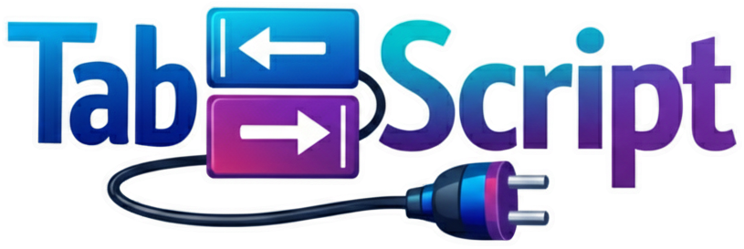

# TabScript

TabScript is an alternative syntax for TypeScript. Like CoffeeScript, but for a more civilized age. Indentation replaces braces and common patterns get shorter syntax.

Due to its plugin system, TabScript is especially well-suited for building domain-specific languages. It lets you extend the language with custom syntax, while still leveraging TypeScript's complete type checking and IDE (VSCode only for now) support.

**[📚 Read the full documentation and interactive tutorial](https://tabscript.vanviegen.net/TabScript_Tutorial/)**

## Quick Example

```tabscript
tabscript 2.0

# Define a constant initialized to a function
greet := |name: string|
	console.log(`Welcome, ${name}`)

interface User
	name: string
	age: number
	active: boolean

processUsers := |users: User[]|
	# Call filter method using .. syntax to avoid parentheses
	active := users.filter.. |u| u.active and u.age >= 18

	# The : below causes `user` to be declared as a const
	for user: of active
		if user.role == "admin" or user.permissions.includes("write")
			greet(user.name)
```

<div class="hide-in-typedoc">

Transpiles to TypeScript:

```typescript
const greet = (name: string) => {
	console.log(`Welcome, ${name}`);
};
interface User {
	name: string
	age: number
	active: boolean
}
const processUsers = (users: User[]) => {
	const active = users.filter((u) => u.active && u.age >= 18);

	for (const user of active) {
		if (user.role === "admin" || user.permissions.includes("write")) {
			greet(user.name);
		}
	}
};
```

</div>

## Installation

```bash
npm install tabscript
```

## Usage

### CLI

```bash
# Transpile to TypeScript (to file.ts by default)
tabscript file.tab

# Transpile to JavaScript with custom output file
tabscript input.tab --js --output output.js

# With pretty formatting (instead attempting to preserve line and column numbers)
tabscript file.tab --whitespace pretty

# Type check without generating files (for CI/git hooks)
tabscript input.tab --check

# Type check multiple files
tabscript src/**/*.tab --check
```

### Bundler Integration

TabScript includes plugins for all major bundlers:

#### Vite

```js
// vite.config.js
import { tabscriptPlugin } from 'tabscript/vite';

export default {
  plugins: [
    tabscriptPlugin({
      // outputMode: 'ts'  // Optional: output TypeScript for type checking
    })
  ]
};
```

#### Webpack

```js
// webpack.config.js
module.exports = {
  module: {
    rules: [
      {
        test: /\.tab$/,
        use: 'tabscript/webpack'
      }
    ]
  }
};
```

#### esbuild

```js
// build.js
import { tabscriptPlugin } from 'tabscript/esbuild';
import * as esbuild from 'esbuild';

await esbuild.build({
  entryPoints: ['src/index.tab'],
  bundle: true,
  plugins: [tabscriptPlugin()]
});
```

#### Rollup

```js
// rollup.config.js
import { tabscriptPlugin } from 'tabscript/rollup';

export default {
  input: 'src/index.tab',
  plugins: [tabscriptPlugin()]
};
```

**Options:**
- `outputMode`: Output format for transpiled code
  - Vite/esbuild: Defaults to `'ts'` (preserves types, handled natively)
  - Webpack/Rollup: Defaults to `'js'` (requires loader config for TS)
- Plus all core transpiler options: `debug`, `recover`, `whitespace`, etc.

**Note on Type Checking:** Type checking for `.tab` files happens in your IDE via the VSCode extension, which transpiles TabScript to TypeScript in memory and uses TypeScript's language service. For CI/CD pipelines and git hooks, use `tabscript --check` to type-check files without generating output. Bundlers only handle build-time transpilation and typically strip types without checking them (for speed). This is the same workflow as TypeScript itself - `tsc` checks types, bundlers just transform code.

**Example CI/CD setup:**
```
# .github/workflows/test.yml
- name: Type check TabScript files
  run: npx tabscript src/**/*.tab --check
```

**Example git hook:**
```bash
# .husky/pre-commit
npx tabscript $(git diff --cached --name-only --diff-filter=ACM | grep '\.tab$') --check
```

## Key Features

- **Indentation-based syntax** - No braces required
- **Shorthands** - `:=` for const, `::=` for let, `||` for function params, `!` for function calls
- **All of TypeScript** - Complete type system support
- **Plugin system** - Extend the language with custom syntax for your DSL
- **VSCode extension** - Full IntelliSense and type checking
- **Browser support** - Runtime transpilation for `.tab` files

## Plugin System

TabScript's plugin system lets you extend the language with custom syntax. Here's a plugin that allows programs to prefix expression with @ in order to wrap them in a log function together with the expression source code:

```tabscript
# @file: inspect-plugin.tab
tabscript 2.0
export default function|p, options|
	orig := p.parseClass.bind(p)
	p.parseClass = |s|
		if !s.read.. '@', '('
			return orig(s)
		s.emit.. 'mylog('
		snap := s.snapshot()
		s.must.. p.parseExpression(s)
		source := JSON.stringify.. snap.getSource()
		s.emit.. ',' + source
		s.must.. s.accept.. ')'
		return true
```

```tabscript
tabscript 2.0
import plugin "./inspect-plugin.tab"
x := 3
y := @(x * 2) + @(Math.sqrt(16))
```

See the [full documentation](https://tabscript.vanviegen.net/TabScript_Tutorial/) for details on writing plugins.

As TabScript uses a lexer-less transpiler architecture and plugins can hook into any part of the parser, just about any syntax extension you can think of is possible. However, as the transpiler is single-pass and doesn't construct an AST, it is best suited for superficial transformations that map cleanly to TypeScript constructs.

## Browser Usage

For in-browser transpilation:

```html
<script type="module">
  import { transpileAll } from 'tabscript/browser';
  await transpileAll(); // Transpiles all <script type="text/tabscript"> tags
</script>

<script type="text/tabscript">
  tabscript 2.0
  console.log.. "Hello from TabScript!"
</script>
```

## VSCode Extension

The TabScript VSCode extension provides full IDE support:

- **Syntax highlighting** - Comprehensive highlighting for TabScript syntax
- **IntelliSense** - Code completion, hover information, and signature help
- **Real-time diagnostics** - Instant error checking and type validation
- **Go to definition** - Navigate to symbol definitions (F12)
- **Symbol renaming** - Rename symbols across your project (F2)
- **Multi-file support** - Works seamlessly with imports between `.tab` files

### Installation

Install from the [Visual Studio Code Marketplace](https://marketplace.visualstudio.com/items?itemName=tabscript.tabscript) or search for "TabScript" in the VSCode extensions panel.

### How It Works

The extension transpiles TabScript to TypeScript in memory as you type, then delegates to TypeScript's language service for all IDE features. This means you get the full power of TypeScript's type system while writing TabScript code.

The extension includes a vendored copy of the TabScript transpiler, but will prefer using a locally installed version from your project's `node_modules` if available. This ensures plugin compatibility and consistent transpilation behavior between your build process and the IDE.

## Learn More

Visit **[tabscript.vanviegen.net](https://tabscript.vanviegen.net/)** for:
- Interactive tutorial with live examples
- Complete language reference
- API documentation
- Real-time transpiler playground

## License

MIT
